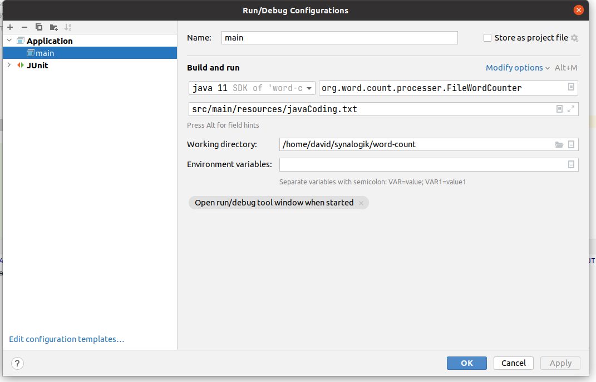

# Word Count 

The word count project is a simple Java maven project that enables to load and read .txt files and display
1. total number of words in each line
2. the average word length in each line, 
3. the most frequently occurring word length in the line,
4. a list of the number of words of each length. 

## Use Word Count API
When you run the main method in FileWordCounter class you can either add a parameter or use the default one that would read helloWord.txt file from a resource.
* parameter to the main method is a string describing a path and file name eg: see image.

   (Image 01)

in IntelliJ IDEA go to:
    *run -> Edit Configuration..*

## Download and Run Word Count Application from the Terminal

To download the word-count app clone the word-count project to your PC by using the command `git clone https://github.com/dsajdl01/word-count.git`

In terminal go to work-count directory `cd work-count` 
Then in the work-count directory run command to build project: `mvn clean install`

Then run project from terminal:

`java -cp target/word-count-1.0-SNAPSHOT.jar org.word.count.processer.FileWordCounter src/main/resources/javaCoding.txt`

or

`java -cp target/word-count-1.0-SNAPSHOT.jar org.word.count.processer.FileWordCounter`  *// without parameter would run default .txt file.*

or any path to your .txt file instead of 'src/main/resources/javaCoding.txt'

*Created By David Sajdl 10 July 2022*

